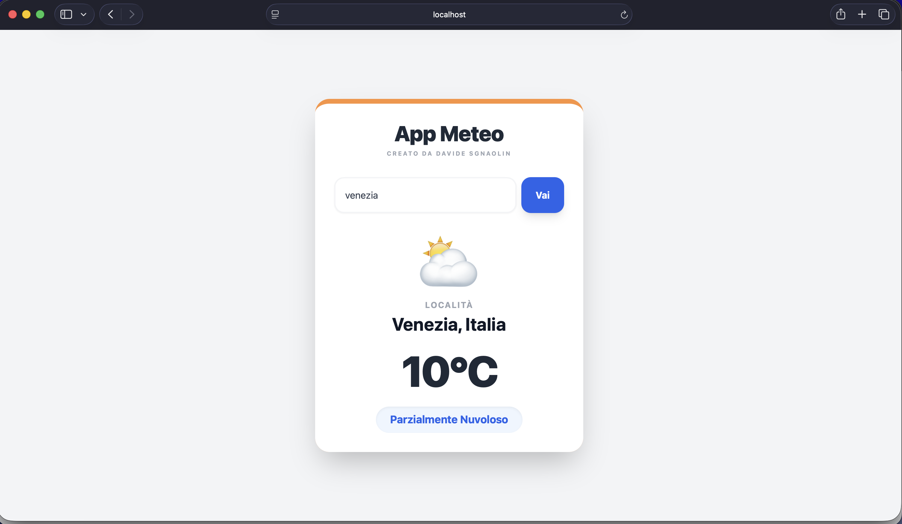

# Meteo App - Fullstack 

### Screenshot dell'applicazione

Progetto di una dashboard meteo per la ricerca di località con dati climatici in tempo reale. L'obiettivo è la gestione della comunicazione tra un frontend e backend dedicato all'interrogazione di API esterne.

### Funzionamento
L'utente inserisce il nome di una città. Il backend riceve la richiesta, esegue il geocoding per trasformare il nome in coordinate e interroga l'API di Open-Meteo. I risultati vengono inviati al frontend che aggiorna l'interfaccia e cambia i colori dei componenti (parte superiore) in base alla temperatura rilevata (azzurro = freddo, arancione = mite, rosso = caldo). Inoltre, sulla base del clima, viene visualizzata un'icona che corrispondete al clima di quella località al momento dell'interrogazione.

### Tecnologie utilizzate

* **Frontend**: Angular.
* **Backend**: Node.js e Express.
* **Stile**: Tailwind CSS per il design.
* **API**: Open-Meteo API. 

### Installazione locale

Per avviare il progetto correttamente è necessario avviare entrambi i componenti (server e client).

**1. Avvio Server**
La dashboard è stata progettata per girare in localhost tramite l'indirizzo http://localhost:4200, una volta avviato client e server.
